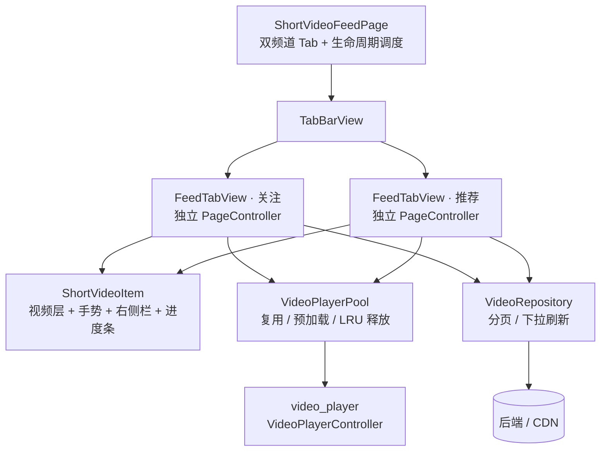

# flutter_short_video

跨平台 Flutter 短视频信息流（抖音式竖屏滑动）实现方案。支持「关注 / 推荐」双频道、竖向全屏滑动切换、播放器复用与滑动预加载、下拉刷新 / 上拉加载更多、点赞 / 双击炸心 / 关注 / 评论 / 分享等完整交互。


## 功能特性

- 竖向全屏滑动切换视频，松手即对齐整屏，循环播放。
- 关注 / 推荐双频道，各自独立 `PageController`，互不干扰。
- 播放器池：controller 按 URL 复用 + LRU 释放，常驻上限 4，滑出窗口自动回收，避免解码器被打爆。
- 滑动预加载：当前屏起播，前后各预加载一屏；距离末尾 3 屏提前请求下一页，消除「滑到底才转圈」。
- 下拉刷新换一批数据并回到首屏；首次加载失败有「重试」入口。
- 默认静音进入（`mixWithOthers` 不抢音频焦点），可一键切换。
- 局部刷新：进度 / 播放态走 `ValueListenableBuilder`，不再每帧 `setState` 重建整屏。
- 交互：单击暂停、双击点赞 + 炸心动画、右侧操作栏（头像 / 点赞 / 评论 / 分享 / 音乐）、可拖拽进度条、评论与分享底部弹层。
- 生命周期：切后台自动暂停，回前台恢复；切频道暂停非可见流。
- 适配：`SafeArea` 适配刘海屏与底部手势区；封面占位消除黑屏；服务端下发宽高比避免首帧布局抖动。

## 技术栈

| 能力 | 选型 |
| --- | --- |
| UI 框架 | Flutter 3.x（Dart 3 SDK） |
| 视频播放 | `video_player` ^2.4.7（官方插件，可平滑升级 2.14+） |
| 状态 | `ChangeNotifier` / `ValueListenableBuilder` 局部监听，未引入额外状态库 |
| 静态检查 | `flutter_lints` ^6 |

## 目录结构

```
lib/
├── main.dart                     # 入口：MaterialApp（深色主题，红种子色）
├── models/
│   └── video_model.dart          # 数据模型 + fromJson 容错 + formatCount
├── data/
│   └── video_repository.dart     # 分页 / 刷新数据层（模拟网络，可替换为真实接口）
├── player/
│   └── video_player_pool.dart    # 播放器池：复用 / 预加载 / LRU 释放
├── widgets/
│   ├── short_video_item.dart     # 单屏：视频层 + 手势 + 右侧栏 + 进度条
│   ├── video_progress_bar.dart   # 可拖拽进度条
│   └── video_side_actions.dart   # 右侧操作栏（头像/点赞/评论/分享/音乐）
└── pages/
    ├── short_video_feed_page.dart# 首页：双频道 Tab + 静音 + 生命周期
    └── feed_tab_view.dart        # 单频道信息流：播放窗口调度 / 刷新 / 加载更多
test/
└── video_model_test.dart         # 数据模型解析单测
```

## 架构示意图



调用要点：

- 页面层 `ShortVideoFeedPage` 只负责「双频道切换 + 全局静音 + App 生命周期」，不参与单条视频的播放细节。
- 每个频道一个 `FeedTabView`，持有**独立** `PageController`；播放权统一交给 `_syncPlayback()` 调度，避免 UI 与页面两处争抢 `seek`。
- 单条视频的渲染与手势在 `ShortVideoItem`，进度 / 播放态只局部刷新，不重建整屏。
- 所有视频共享同一个 `VideoPlayerPool`，由它决定「谁该起播、谁该预加载、谁该释放」。

## 核心设计

### 播放器池（`lib/player/video_player_pool.dart`）

短视频不能每屏新建播放器（实例过多会打爆解码器、二次进入必转圈）。`VideoPlayerPool` 解决三件事：

- `entryFor(url)`：按 URL 取用 / 创建播放单元，命中即复用。
- `preload(urls)`：提前初始化并停在首帧，滑到时直接起播。
- `retainOnly(keep)`：滑动时只保留「当前 ±1 屏」实例，其余 dispose。
- `capacity`（默认 4）+ LRU 兜底，防止极端情况下实例无限增长。

`VideoPlayerEntry` 用 `ChangeNotifier` 广播 `idle / loading / ready / failed` 状态，UI 侧用 `ListenableBuilder` 消费，**从根源上避免旧实现「dispose 后回调 setState 崩溃」** 与每帧整页重建。

### 播放窗口调度（`lib/pages/feed_tab_view.dart`）

单频道持有独立 `PageController`；`FeedTabView._syncPlayback()` 统一负责「起播当前屏 / 预加载邻屏 / 释放窗口外」——播放权归页面层，避免 UI 与页面两处同时 seek 导致首帧回退。距末尾 3 屏触发 `_loadMore()`，而非滑到底才请求。

### 生命周期（`lib/pages/short_video_feed_page.dart`）

- `WidgetsBindingObserver`：App `paused/hidden` 时 `pool.pauseAll()`，`resumed` 时递增 `resumeToken` 恢复播放。
- 切频道：先 `pauseAll()`，目标频道在 `didUpdateWidget` 重新起播。
- 默认 `_muted = true`，静音进入信息流。

## 运行方式

```bash
flutter pub get
flutter run            # 真机 / 模拟器，iOS 与 Android 均支持

# 校验
flutter analyze        # 应无告警
flutter test           # video_model 解析单测
```

> **Android 网络权限**：`INTERNET` 已写入 `android/app/src/main/AndroidManifest.xml`（初版只写在 debug manifest，导致 release 包视频加载失败）。

## 后端对接约定

`VideoRepository` 当前为模拟数据，接入真实接口时让后端按 `VideoModel.fromJson` 下发字段即可。`fromJson` 已做类型容错（数字可能是 int / String / num，布尔可能是 `true` / `1` / `"1"`），不会因字段类型漂移直接白屏。

### 字段表

| 字段 | 类型 | 必填 | 说明 |
| --- | --- | --- | --- |
| `id` | String | 是 | 视频唯一标识，用作列表 `ValueKey` |
| `url` | String | 是 | 视频播放地址（网络地址） |
| `coverUrl` | String | 否* | 首帧封面图，消除滑动后的黑屏（**强烈建议下发**） |
| `desc` | String | 否 | 视频描述文案 |
| `authorName` | String | 否 | 作者昵称 |
| `authorAvatar` | String | 否 | 作者头像地址 |
| `musicName` | String | 否 | 背景音乐 / BGM 名称 |
| `likeCount` | int | 否 | 点赞数，UI 用 `formatCount` 格式化为「1.2w」 |
| `commentCount` | int | 否 | 评论数 |
| `shareCount` | int | 否 | 分享数 |
| `aspectRatio` | double | 否* | 宽 / 高（如 `0.5625` 表示 9:16），避免首帧布局抖动（**强烈建议下发**） |
| `liked` | bool | 否 | 当前用户是否已赞 |
| `followed` | bool | 否 | 当前用户是否已关注作者 |

> 带 `*` 的字段虽非必填，但**不下发会明显拉低体验**：缺 `coverUrl` 滑入即黑屏，缺 `aspectRatio` 首帧尺寸跳变导致整屏抖动。

### 单条视频示例 JSON

```json
{
  "id": "v_88231",
  "url": "https://cdn.example.com/v/88231.m3u8",
  "coverUrl": "https://cdn.example.com/v/88231_cover.jpg",
  "desc": "周末的citywalk，治愈一整周的通勤",
  "authorName": "阿布在路上",
  "authorAvatar": "https://cdn.example.com/u/88231.jpg",
  "musicName": "原声 - 阿布在路上",
  "likeCount": 128400,
  "commentCount": 3201,
  "shareCount": 540,
  "aspectRatio": 0.5625,
  "liked": false,
  "followed": false
}
```

### 分页约定

`VideoRepository.fetchFeed(channel, page, salt)` 按页拉取，接入真实接口时建议：

- 请求：`GET /feed?channel=推荐&page=0&size=10`，`page` 从 0 开始，每页 10 条。
- 响应：返回上述字段的对象数组，空数组表示无更多数据（UI 停止触发加载更多）。
- `salt`（下拉刷新时自增）用于打乱分页种子、实现「换一批」效果，真实接口可用 `refreshToken` 代替。
- 推荐用 HLS（`.m3u8`）或带 `Range` 支持的 MP4，便于后续做边播边缓存。

## 接入真实接口

`VideoRepository` 当前是模拟实现，UI 层（`FeedTabView`）只依赖它、不关心数据来源，因此切换真实接口成本很低。

### 方式一：最小改动（直接改 `fetchFeed` 内部）

在 `pubspec.yaml` 增加 `http: ^1.2.0`，然后把 `VideoRepository.fetchFeed` 的方法体换成网络请求即可，签名与字段保持不变，属于「原地替换」：

```dart
import 'dart:convert';
import 'package:http/http.dart' as http;
import '../models/video_model.dart';

class VideoRepository {
  VideoRepository({this.pageSize = 8, this.baseUrl = 'https://api.example.com'});
  final int pageSize;
  final String baseUrl;

  Future<List<VideoModel>> fetchFeed({
    required String channel,
    required int page,
    int salt = 0,
  }) async {
    final uri = Uri.parse('$baseUrl/feed').replace(queryParameters: {
      'channel': channel,
      'page': '$page',
      'size': '$pageSize',
      'refresh': '$salt',
    });
    final res = await http.get(uri, headers: {'Accept': 'application/json'});
    if (res.statusCode != 200) {
      throw Exception('拉取信息流失败：${res.statusCode}');
    }
    final List<dynamic> list = jsonDecode(res.body) as List<dynamic>;
    // fromJson 已做类型容错，后端字段类型漂移也不会直接白屏。
    return list
        .map((e) => VideoModel.fromJson(e as Map<String, dynamic>))
        .toList(growable: false);
  }
}
```

### 方式二：抽出数据源接口（生产推荐）

把数据源定义为抽象类，让 `FeedTabView` 依赖接口而非具体类，便于单元测试与多实现切换（如 mock / 灰度 / A-B）：

```dart
abstract class VideoFeedSource {
  Future<List<VideoModel>> fetchFeed({
    required String channel,
    required int page,
    int salt = 0,
  });
}

class HttpVideoRepository implements VideoFeedSource {
  // ... 同方式一的 fetchFeed 实现
}

// FeedTabView 构造参数由 VideoRepository 改为 VideoFeedSource：
// final VideoFeedSource repository;
```

> 采用方式二时，记得把 `feed_tab_view.dart` 中 `repository` 的类型从 `VideoRepository` 改成 `VideoFeedSource`。

